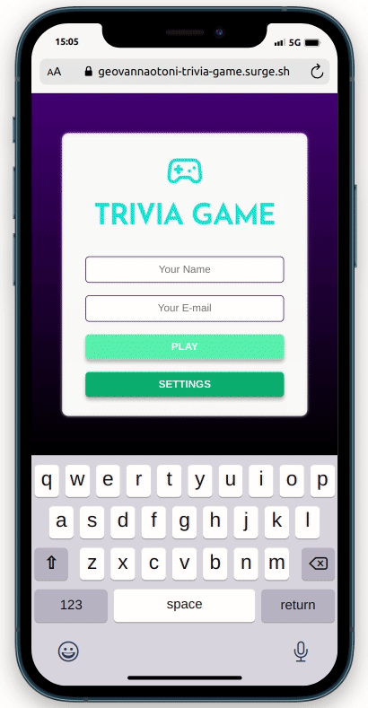

# Trivia Game
Projeto em grupo que consiste em um jogo de perguntas e respostas baseado no jogo Trivia utilizando React e Redux. A aplicação permite que a pessoa usuária possa:
- Logar no jogo e, se o email tiver cadastro no site Gravatar, ter sua foto associada ao perfil.
- Acessar a página referente ao jogo, onde se deverá escolher uma das respostas disponíveis para cada uma das perguntas apresentadas. A resposta deve ser marcada antes do contador de tempo chegar a zero.
- Ser redirecionada, após 5 perguntas respondidas, para a tela de score.
- Visualizar a página de ranking ao final de cada jogo.

Também foram utilizadas ferramentas de metodologias ágeis, como Kanban e SCRUM.
  

## :computer: Visualize este projeto:
Acesse a página aqui:
[https://geovannaotoni-trivia-game.surge.sh/](https://geovannaotoni-trivia-game.surge.sh/)

## :bulb: Habilidades:
Feito a partir dos conhecimentos de CSS, HTML, JavaScript, JSX, React e React Router Dom, estados globais com Redux, Testes com React-Testing-Library, Componentes de Classe, PropTypes, NPM e Requisições via API.